```{r}
knitr::opts_chunk$set(warning=FALSE, message=FALSE)
```

#Part 1
##Descriptive 1

```{r}
library(tidyverse)
library(broom)
library(performance)
library(ordinal)
library(car)
library(ggeffects)
library(gofcat)
library(brms)
library(emmeans)
library(knitr)
library(dplyr)
library(ggplot2)
library(tidyr)
library(gridExtra)
library(grid)
library(MASS) 
library(reshape2) 
library(reshape) 
library(logistf)
library(corrplot)
```

First we load the data for the first half of the concert, removing columns we don't want. I've also recoded the hall locations into two factors, 'Downstairs' and 'Upstairs'.

```{r}
#Loading dataset, sheet 1

library(conflicted)
conflict_prefer("filter", "dplyr")

data_paper <- read_csv("input/PUC1.csv")
```
First we need to recode some of the values in the dataframe.

```{r}
recode <- c("1" = "Not at all",
                "2" = "A small amount of the time",
                "3" = "A moderate amount of the time",
                "4" = "Most of the time",
                "5" = "All of the time")

recode2 <- c("1" = "Not at all",
             "2" = "Slightly",
             "3" = "Moderately",
             "4" = "Mostly",
             "5" = "Entirely")

recode3 <- c("1" = "Very rarely",
             "2" = "Somewhat rarely",
             "3" = "Moderately frequently",
             "4" = "Frequently",
             "5" = "Very frequently")

data_paper[, 2:10] <- lapply(data_paper[, 2:10], function(x) recode[as.character(x)])
data_paper[, 13:15] <- lapply(data_paper[, 13:15], function(x) recode2[as.character(x)])
data_paper[, 18:20] <- lapply(data_paper[, 18:20], function(x) recode2[as.character(x)])
data_paper[, 24] <- lapply(data_paper[, 24], function(x) recode3[as.character(x)])

```


Then we load the qualtrics data.

```{r}
library(conflicted)
conflict_prefer("filter", "dplyr")

data_qualtrics <- read_csv("input_qualtrics/PUC1.csv")
data_qualtrics <- data_qualtrics %>% dplyr::filter(Finished == "TRUE") %>% 
  dplyr::select(-StartDate, -EndDate, -Status, -Progress, -Duration, 
         -RecordedDate, -DistributionChannel, -UserLanguage, -Finished, -Q1, -ResponseId)

```

The way people select composer and movements is different for the two surveys so we need to get them in a matching format:

```{r}
composer_initials <- data.frame(
  composer = c("Beethoven", "Hough"),
  composer_initial = c("B", "H")
)

data_long <- data_qualtrics %>%
  pivot_longer(
    cols = starts_with("Movement"),
    names_to = "source_col",
    values_to = "movement_label"
  ) %>%
  filter(!is.na(movement_label)) %>%
  mutate(
    composer = case_when(
      str_detect(source_col, "_B_") ~ "Beethoven",
      str_detect(source_col, "_H_") ~ "Hough"
    ),
    type = case_when(
      str_detect(source_col, "_mem$") ~ "mem",
      str_detect(source_col, "_story$") ~ "story"
    ),
    movement = as.integer(str_extract(movement_label, "\\d+"))
  ) %>%
  left_join(composer_initials, by = "composer") %>%
  mutate(code = paste0(composer_initial, movement))

data_wide <- data_long %>%
  dplyr::select(ID, type, code) %>%
  pivot_wider(
    names_from = type,
    values_from = code,
    names_prefix = "Movement_"
  )

final_qualtrics <- data_qualtrics %>%
  left_join(data_wide, by = "ID")
```


```{r}
# Combine the data frames
data <- bind_rows(data_paper, final_qualtrics)
data <- data%>% dplyr::select(-Movement_H_story, -Movement_B_story, -Piece_story, -Movement_H_mem, -Movement_B_mem, -Piece_mem)
```


A dataframe is created showing thought types in a long format with counts for each frequency.

```{r}
thought_types <- c("Fictional_story", "Abstract_shapes", "Sensory_sensations", "Life_experiences", "Media", "Music", "Future_plans", "Building", "Everyday")

thoughts_long <- data %>%
  pivot_longer(cols = thought_types,
               names_to = "Category", 
               values_to = "Response") %>%
  count(Category, Response) %>% 
  mutate(Response = factor(Response, 
                           levels = c("Not at all", 
                                      "A small amount of the time", 
                                      "A moderate amount of the time", 
                                      "Most of the time", 
                                      "All of the time"))) %>% 
  mutate(Category = factor(Category, levels = rev(c("Fictional_story", 
                                                    "Abstract_shapes", 
                                                    "Sensory_sensations", 
                                                    "Life_experiences", 
                                                    "Media", 
                                                    "Music", 
                                                    "Future_plans", 
                                                    "Building", 
                                                    "Everyday")))) %>% filter(!is.na(Response))
```


This dataframe is used for the first plot, which shows the counts for each type of thought during the first half.

```{r}
ggplot(thoughts_long, aes(x = Response, y = Category, fill = n)) +
  geom_tile(color = "white") +  # Add white borders to tiles
  scale_fill_gradient(low = "lightblue", high = "darkblue") +  # Adjust color gradient
  labs(title = "Counts for Thought Types, First Half", x = NULL, y = NULL, fill = "Count") +
  theme_minimal() +
  theme(axis.text.x = element_text(angle = 45, hjust = 1))  # Rotate x-axis labels

ggsave("Plots/Descriptive/Overall thought counts, part1.png", width = 7, height = 5, dpi = 300, bg = "white")

```

Then we examine the counts for the movements people select as invoking the most vivid memory or story. 
```{r}
mems <- data$Movement_mem %>% na.omit() %>% toupper()
stories <- data$Movement_story %>% na.omit() %>% toupper()


# Split values by ";", ",", or whitespace
split_values_mem <- unlist(strsplit(mems, "[; ,]+"))
split_values_story <- unlist(strsplit(stories, "[; ,]+"))

# Trim whitespace
split_values_mem <- trimws(split_values_mem)
split_values_story <- trimws(split_values_story)

# Count occurrences
value_counts_mem <- table(split_values_mem)
value_counts_story <- table(split_values_story)


```

The movement counts are then plotted.

```{r}
#Reorder the Movement factor levels for Beethoven and Hough

recode_map <- c("B1" = "Beethoven, Movement 1 — Allegro con brio",
                "B2" = "Beethoven, Movement 2 — Adagio affettuoso ed appassionato",
                "B3" = "Beethoven, Movement 3 — Scherzo",
                "B4" = "Beethoven, Movement 4 — Allegro",
                "H1" = "Hough, Movement 1 — Au boulevard",
                "H2" = "Hough, Movement 2 — Au parc",
                "H3" = "Hough, Movement 3 — À l'hôtel",
                "H4" = "Hough, Movement 4 — Au théâtre",
                "H5" = "Hough, Movement 5 — À l'église",
                "H6" = "Hough, Movement 6 — Au marché")


# Recode values to descriptive names using recode_map
recoded_mem <- dplyr::recode(split_values_mem, !!!recode_map)
recoded_story <- dplyr::recode(split_values_story, !!!recode_map)

# Convert recoded values to data frames
df_mem_counts <- as.data.frame(table(recoded_mem))
colnames(df_mem_counts) <- c("Movement", "count")

df_story_counts <- as.data.frame(table(recoded_story))
colnames(df_story_counts) <- c("Movement", "count")

# Add a Composer column (Beethoven for B1-B4, Hough for H1-H6)
df_mem_counts$Composer <- ifelse(grepl("^Beethoven", df_mem_counts$Movement), "Beethoven", "Hough")
df_story_counts$Composer <- ifelse(grepl("^Beethoven", df_story_counts$Movement), "Beethoven", "Hough")

# Set movement factor levels for proper ordering
df_mem_counts$Movement <- factor(df_mem_counts$Movement, levels = recode_map)
df_story_counts$Movement <- factor(df_story_counts$Movement, levels = recode_map)

# Plot for 'memories'
mem_plot <- ggplot(df_mem_counts, aes(x = Movement, y = count, fill = Movement)) +
  geom_bar(stat = "identity", position = "dodge") +
  facet_wrap(~ Composer, scales = "free_x") +  # Separate Beethoven & Hough
  theme_minimal() +
  labs(title = "Movement Counts for Memories", x = "Movement", y = "Count") +
 theme(axis.title.x = element_blank(),  # Remove x-axis title
        axis.text.x = element_blank(),   # Remove x-axis labels
        axis.ticks.x = element_blank()) +
  scale_fill_brewer(palette = "Set3") + 
  guides(fill = guide_legend(title = "Movement")) +
  scale_y_continuous(breaks = scales::breaks_pretty(n = 5))  


ggsave("Plots/Descriptive/Movement counts for memories, part 1.png", plot = mem_plot, width = 7, height = 5, dpi = 300, bg = 'white')

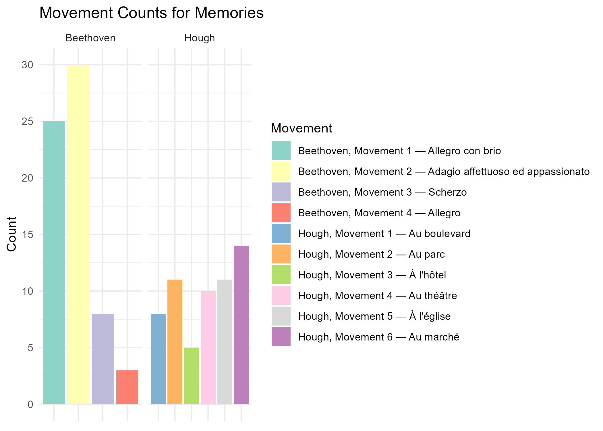

# Plot for 'stories'
story_plot <- ggplot(df_story_counts, aes(x = Movement, y = count, fill = Movement)) +
  geom_bar(stat = "identity", position = "dodge") +
  facet_wrap(~ Composer, scales = "free_x") +  # Separate Beethoven & Hough
  theme_minimal() +
  labs(title = "Movement Counts for Stories", x = "Movement", y = "Count") +
 theme(axis.title.x = element_blank(),  # Remove x-axis title
        axis.text.x = element_blank(),   # Remove x-axis labels
        axis.ticks.x = element_blank()) +
  scale_fill_brewer(palette = "Set3") + 
  guides(fill = guide_legend(title = "Movement")) +
  scale_y_continuous(breaks = scales::breaks_pretty(n = 5)) 

ggsave("Plots/Descriptive/Movement counts for stories, part 1.png", plot = story_plot, width = 7, height = 5, dpi = 300, bg = 'white')

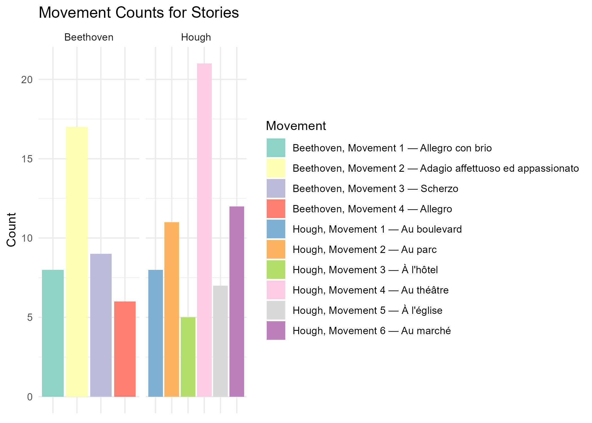

```
In the next descriptive phase, we want to look at how demographics variables are associated with different types of thoughts. First, we tidy the demographics data and make sure it's classed in the right way.

```{r}
#Creating a 'floor' variable, with 2 factors showing downstairs and upstairs locations.
data <- data %>%
  mutate(Floor = ifelse(Location %in% c("A", "B", "C", "D", "E", "F"), "Downstairs", "Upstairs")) %>% relocate(Floor, .after = Location)

#Removing NA.s?
data <- data %>%
  filter(!is.na(Age) & !is.na(Gender) & !is.na(Music_listening) & !is.na(Floor) & !is.na(Fictional_story) & !is.na(Practice)) %>%
  filter(!is.infinite(Age) & !is.infinite(Gender) & !is.infinite(Music_listening) & 
         !is.infinite(Floor) & !is.infinite(Fictional_story) & !is.infinite(Practice))

#Making sure demographic variables are classed in the right way.
data$Age <- as.numeric(data$Age)
data$Practice <- as.numeric(as.character(data$Practice))
data$Gender <- factor(data$Gender,  levels = c('Male', 'Female', 'Other'))
data$Music_listening <- factor(data$Music_listening, levels = c('Very rarely', 'Somewhat rarely', 'Moderately frequently', 'Frequently', 'Very frequently'))
data$Floor <- factor(data$Floor, levels = c('Downstairs', 'Upstairs'))
data$Fictional_story <- factor(data$Fictional_story, 
                               levels = c("Not at all", "A small amount of the time", 
                                          "A moderate amount of the time", 
                                          "Most of the time", "All of the time"))

```

Various descriptive plots can be made, but there are 3 below for age, gender and floor.

1) Descriptive plot for Age and types of thought -- age is converted into a grouped variable:

```{r}
# Create Age bins
data <- data %>%
  mutate(Age_group = cut(Age, 
                         breaks = seq(floor(min(Age, na.rm = TRUE)), 
                                      ceiling(max(Age, na.rm = TRUE)) + 20, by = 5), 
                         include.lowest = TRUE, 
                         right = FALSE))

# List of outcome variables
outcome_vars <- c("Fictional_story", "Abstract_shapes", "Sensory_sensations", 
                  "Life_experiences", "Media", "Music", "Future_plans", 
                  "Building", "Everyday")

# Converting outcome variables to factors with consistent levels for each thought type
data[outcome_vars] <- lapply(data[outcome_vars], factor, 
                             levels = c("Not at all", "A small amount of the time", 
                                        "A moderate amount of the time", "Most of the time", 
                                        "All of the time"))

# Creating a single summary_data dataframe
summary_data <- data %>%
  pivot_longer(cols = all_of(outcome_vars), names_to = "Outcome", values_to = "Response") %>%
  group_by(Age_group, Outcome, Response) %>%
  summarise(count = n(), .groups = "drop") %>%
  group_by(Age_group, Outcome) %>%
  mutate(prop = count / sum(count)) %>%
  ungroup()

# Looping through each outcome variable to generate plots
plot_list <- list()

for (outcome in outcome_vars) {
    plot_data <- summary_data %>% filter(Outcome == outcome)
    plot <- ggplot(plot_data, aes(x = Age_group, y = prop, fill = Response)) +
      geom_bar(stat = "identity", position = "stack", alpha = 0.8) + 
      labs(x = "\nAge Group", y = "Proportion\n", title = paste(outcome)) +
      scale_fill_manual(name = "Response Level",
                        values = setNames(c("#deebf7", "#9ecae1", "#3182bd", "#08519c", "#08306b"),
                                          levels(data[[outcome]]))) +
      theme_minimal() + 
      theme(axis.text.x = element_text(angle = 45, hjust = 1))

  plot_list[[outcome]] <- plot
}

# Arranging plots in a grid and saving

title_grob <- textGrob("Types of Thoughts by Age Group, First Half", gp = gpar(fontsize = 16, fontface = "bold"))

Age_thoughts_grid <- invisible(grid.arrange(
  grobs = plot_list, 
  ncol = 3, 
  top = title_grob  
))

ggsave("Plots/Descriptive/Age and thoughts, part 1.png", plot = Age_thoughts_grid, width = 20, height = 12, dpi = 300, bg = 'white')

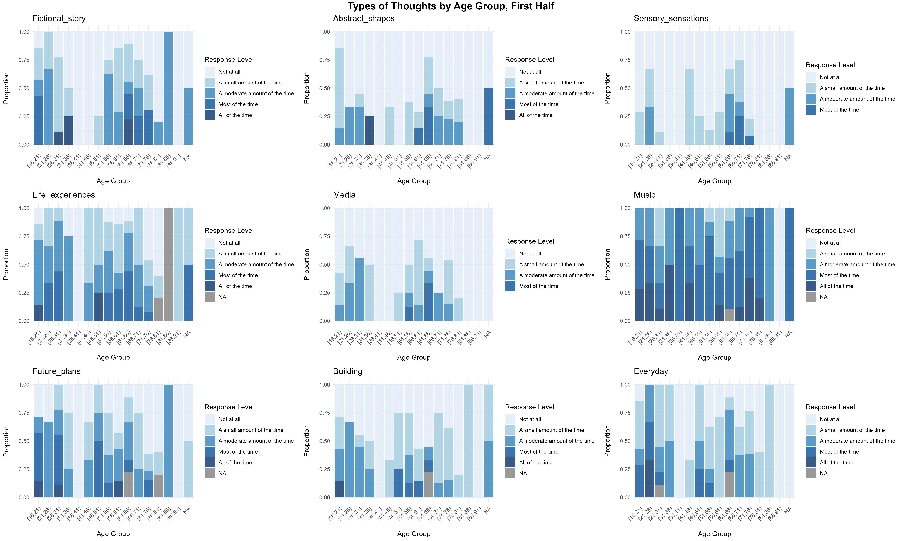

```
2) Descriptive plot for gender and types of thought -- for now gender has been filtered for male and female.

```{r}
# Remove missing values + filter
data <- data %>%
  filter(!is.na(Gender)) %>% filter(Gender != 'Other')

# Create a single summary_data dataframe
summary_data <- data %>%
  pivot_longer(cols = all_of(outcome_vars), names_to = "Outcome", values_to = "Response") %>%
  group_by(Gender, Outcome, Response) %>%
  summarise(count = n(), .groups = "drop") %>%
  group_by(Gender, Outcome) %>%
  mutate(prop = count / sum(count)) %>%
  ungroup()

# Looping through each outcome variable to generate plots
plot_list <- list()

for (outcome in outcome_vars) {
    plot_data <- summary_data %>% filter(Outcome == outcome)
    plot <- ggplot(plot_data, aes(x = Gender, y = prop, fill = Response)) +
      geom_bar(stat = "identity", position = "stack", alpha = 0.8) + 
      labs(x = "\nGender", y = "Proportion\n", title = paste(outcome)) +
      scale_fill_manual(name = "Response Level",
                        values = setNames(c("#deebf7", "#9ecae1", "#3182bd", "#08519c", "#08306b"),
                                          levels(data[[outcome]]))) +
      theme_minimal() + 
      theme(axis.text.x = element_text(angle = 45, hjust = 1))

  plot_list[[outcome]] <- plot
}

title_grob <- textGrob("Types of Thoughts by Gender, First Half", gp = gpar(fontsize = 16, fontface = "bold"))

Gender_thoughts_grid <- grid.arrange(
  grobs = plot_list, 
  ncol = 3, 
  top = title_grob  
)

ggsave("Plots/Descriptive/Gender and thoughts, part 1.png", plot = Gender_thoughts_grid, width = 20, height = 12, dpi = 300, bg = 'white')

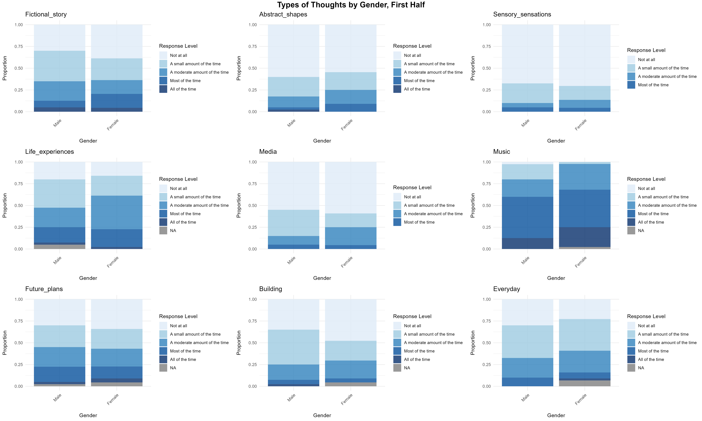

```

3) Descriptive plot for floor
```{r}
# Remove missing values
data <- data %>%
  filter(!is.na(Floor))

# Create a single summary_data dataframe
summary_data <- data %>%
  pivot_longer(cols = all_of(outcome_vars), names_to = "Outcome", values_to = "Response") %>%
  group_by(Floor, Outcome, Response) %>%
  summarise(count = n(), .groups = "drop") %>%
  group_by(Floor, Outcome) %>%
  mutate(prop = count / sum(count)) %>%
  ungroup()

# Looping through each outcome variable to generate plots
plot_list <- list()

for (outcome in outcome_vars) {
    plot_data <- summary_data %>% filter(Outcome == outcome)
    plot <- ggplot(plot_data, aes(x = Floor, y = prop, fill = Response)) +
      geom_bar(stat = "identity", position = "stack", alpha = 0.8) + 
      labs(x = "\nFloor", y = "Proportion\n", title = paste(outcome)) +
      scale_fill_manual(name = "Response Level",
                        values = setNames(c("#deebf7", "#9ecae1", "#3182bd", "#08519c", "#08306b"),
                                          levels(data[[outcome]]))) +
      theme_minimal() + 
      theme(axis.text.x = element_text(angle = 45, hjust = 1))

  plot_list[[outcome]] <- plot
}

title_grob <- textGrob("Types of Thoughts by Floor, First Half", gp = gpar(fontsize = 16, fontface = "bold"))

Floor_thoughts_grid <- grid.arrange(
  grobs = plot_list, 
  ncol = 3, 
  top = title_grob  
)

ggsave("Plots/Descriptive/Floor and thoughts, part 1.png", plot = Floor_thoughts_grid, width = 20, height = 12, dpi = 300, bg = 'white')

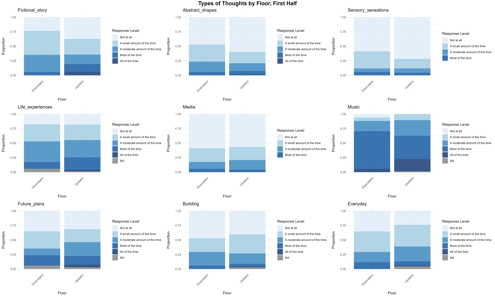

```


##Modelling 1

The next phase in the analysis is to begin constructing some ordinal regression models describing the relationship between demographic data and thought types.

I'm starting by filtering through the demographic variables for each thought type, and seeing which ones, if any, have effects on thought types in an ordinal regression model.
```{r}
# List to store results
models <- list()
stepwise_models <- list()

# Loop through selected outcomes
for (outcome in outcome_vars) {
  formula <- as.formula(paste(outcome, "~ Age + Gender + Music_listening + Practice + Floor"))
  
  # Drop rows with NA values in the outcome or predictors
  vars_to_check <- c(outcome, "Age", "Gender", "Music_listening", "Practice", "Floor")
  data_subset <- data[complete.cases(data[vars_to_check]), ]

  # Debugging message
  cat("\nProcessing:", outcome, 
      " | Rows before:", nrow(data), 
      " | Rows after NA removal:", nrow(data_subset), "\n")

  tryCatch({
    # Fit proportional odds model
    model <- polr(formula, data = data_subset, Hess = TRUE, method = "probit", 
                  control = list(maxit = 1000), na.action = na.exclude)
    
    # Store model
    models[[outcome]] <- model
    
    # Print summary
    cat("\nSummary for", outcome, ":\n")
    print(summary(model))
    
    # Perform stepwise regression
    step_model <- step(model, direction = "backward", trace = FALSE)
    stepwise_models[[outcome]] <- step_model
    
    # Print stepwise summary
    cat("\nStepwise Model Summary for", outcome, ":\n")
    print(summary(step_model))
    
  }, error = function(e) {
    cat("\nSkipping", outcome, "due to error:", conditionMessage(e), "\n")
  })
}

```


Emmeans plots can be used to visualise the ordinal regression models, as shown below here for the relationship between Age and each thought type.
```{r}
# Only some of the outcome variables can be successfully plotted
library(gridExtra)

outcome_vars <- c("Fictional_story", "Abstract_shapes",
                  "Life_experiences", "Music", "Future_plans", 
                   "Everyday")

plot_list <- list()
for (outcome in outcome_vars) {
model <- polr(as.formula(paste(outcome, "~ Age")), data = data, Hess = TRUE)

predicted_probs <- ggemmeans(model, terms = c("Age"))
  
plot <- ggplot(predicted_probs, aes(x = x, y = predicted, fill = response.level)) +
    geom_area() + 
    labs(x = "\nAge", 
         y = "Predicted Probability\n", 
         title = paste(outcome, "by Age")) +
    scale_fill_manual(name = NULL,
                      values = setNames(c("#deebf7", "#9ecae1", "#3182bd", "#08519c", "#08306b"),
                                        levels(data[[outcome]])),
                      labels = c("Not at all", "A small amount of the time", "A moderate amount of the time", "Most of the time", "All of the time"),
                      breaks = c("Not at all", "A small amount of the time", "A moderate amount of the time", "Most of the time", "All of the time")
                      ) + theme_minimal()
  

  plot_list[[outcome]] <- plot
}

title_grob <- textGrob("Types of Thoughts by Age, First Half", gp = gpar(fontsize = 16, fontface = "bold"))

Age_thoughts_models <- grid.arrange(
  grobs = plot_list, 
  ncol = 3, 
  top = title_grob  
)

ggsave("Plots/Models/Thoughts and age, part 1.png", plot = Age_thoughts_models, width = 17, height = 7, dpi = 300, bg = 'white')

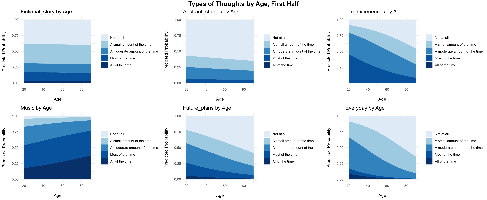

```


After narrowing down models using the step() method above, the main predictors are Music_listening and Practice for abstract shapes, Age for life experiences, Practice for music, and Age and practice for future plans. These can be plotted below.

```{r}
mod1 <- polr(formula = Abstract_shapes ~ Practice + Music_listening, data = data, Hess = TRUE, method = "probit")
mod2 <- polr(formula = Life_experiences ~ Age, data = data, Hess = TRUE, method = "probit")
mod3 <- polr(formula = Music ~ Practice, data = data, Hess = TRUE, method = "probit")
mod4 <- polr(formula = Future_plans ~ Age + Practice, data = data, Hess = TRUE, method = "probit")

pred1 <- ggemmeans(mod1, terms = c("Practice", "Music_listening"))
pred2 <- ggemmeans(mod2, terms = c("Age"))
pred3 <- ggemmeans(mod3, terms = c("Practice"))
pred4 <- ggemmeans(mod4, terms = c("Age", "Practice"))

custom_colors <- c("Not at all" = "#deebf7", 
                   "A small amount of the time" = "#9ecae1", 
                   "A moderate amount of the time" = "#3182bd", 
                   "Most of the time" = "#08519c", 
                   "All of the time" = "#08306b")


# Plot for Abstract Shapes by Music Listening & Practice
p1 <- ggplot(pred1, aes(x = x, y = predicted, fill = response.level)) +
     geom_area(alpha = 1) + 
     facet_wrap(~ group, scales = "free_y") +  
     labs(x = "Practice", y = "Predicted Probability\n", title = "Abstract Shapes by Practice, Faceted by Classical Music Listening") +
     scale_fill_manual(name = NULL, values = custom_colors) +
     theme_minimal() +
     theme(legend.position = "bottom")

ggsave("Plots/Models/Top model Abstract Shapes, part 1.png", plot = p1, width = 10, height = 7, dpi = 300, bg = 'white')

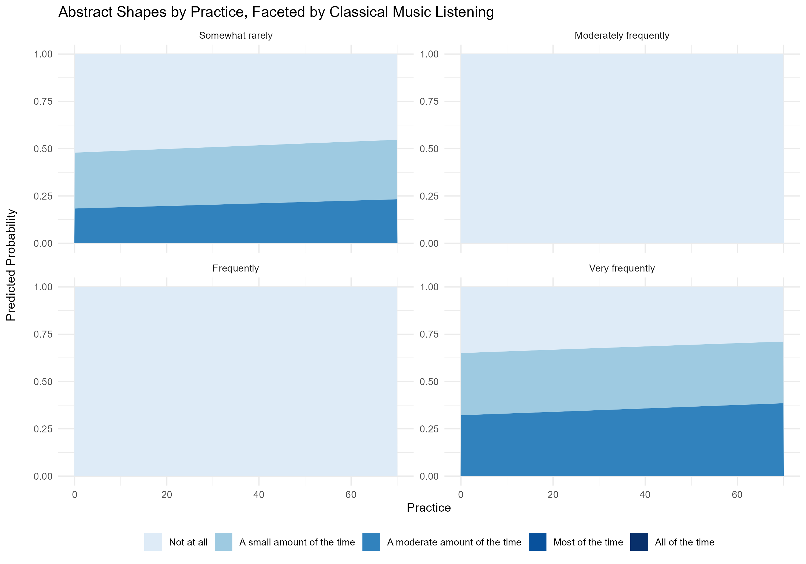


# Plot Life Experiences by Age
p2 <- ggplot(pred2, aes(x = x, y = predicted, fill = response.level)) +
  geom_area() + 
  labs(x = "\nAge", y = "Predicted Probability\n", title = "Life Experiences by Age") +
  scale_fill_manual(name = NULL, values = custom_colors) +
  theme_minimal()

ggsave("Plots/Models/Top model Life Experiences, part 1.png", plot = p2, width = 6, height = 4, dpi = 300, bg = 'white')

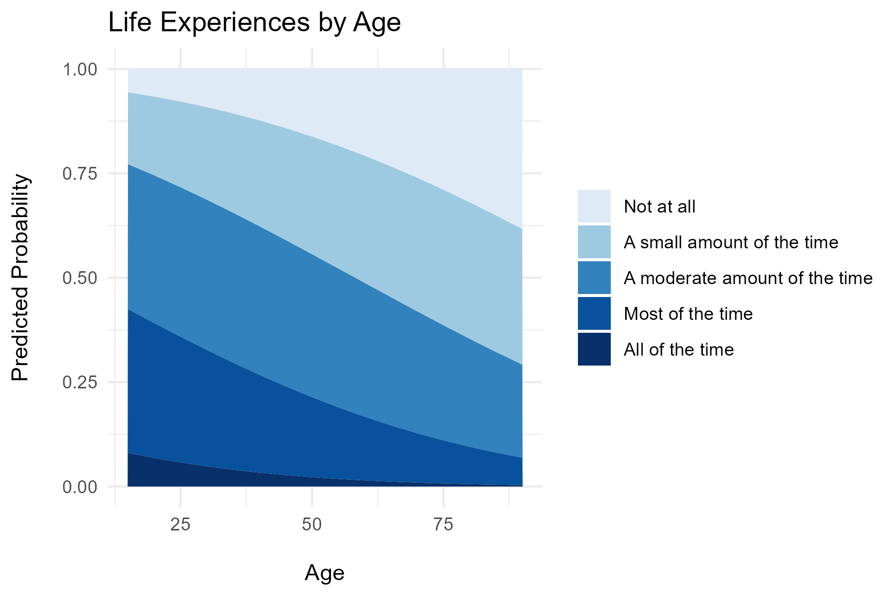

# Plot for Music by Practice
p3 <- ggplot(pred3, aes(x = x, y = predicted, fill = response.level)) +
  geom_area() + 
  labs(x = "\nPractice", y = "Predicted Probability\n", title = "Music by Practice") +
  scale_fill_manual(name = NULL, values = custom_colors) +
  theme_minimal()

ggsave("Plots/Models/Top model Music, part 1.png", plot = p3, width = 6, height = 4, dpi = 300, bg = 'white')

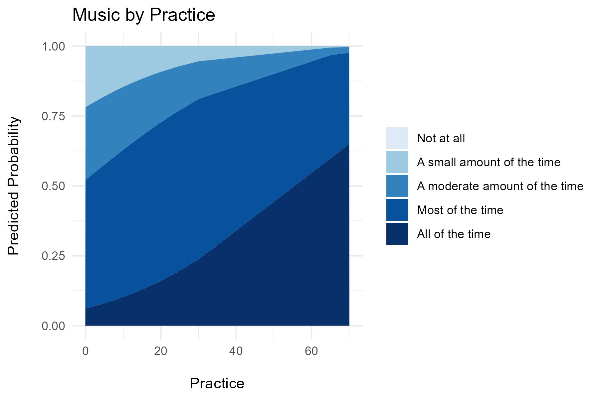

#Plot for Future Plans by Age & Practice -- converting practice into a grouped variable for readability
practice_grouped_data <- practice_grouped_data <- data %>%
  mutate(Practice_grouped = cut(Practice, 
                                breaks = seq(min(Practice, na.rm = TRUE), 
                                            max(Practice, na.rm = TRUE), 
                                            by = 10)))

mod5 <- polr(formula = Future_plans ~ Age + Practice_grouped, data = practice_grouped_data, Hess = TRUE, method = "probit")

pred5 <- ggemmeans(mod5, terms = c("Age", "Practice_grouped"))

p4 <- ggplot(pred5, aes(x = x, y = predicted, fill = response.level)) +
     geom_area(alpha = 1) +
     facet_wrap(~ group, scales = "free_y") +  # Facet by Practice
     labs(x = "\nAge", y = "Predicted Probability\n", title = "Future Plans by Age, Faceted by Practice") +
     scale_fill_manual(name = NULL, values = custom_colors) +
     theme_minimal() +
     theme(legend.position = "bottom")

ggsave("Plots/Models/Top model Future Plans, part 1.png", plot = p4, width = 10, height = 7, dpi = 300, bg = 'white')

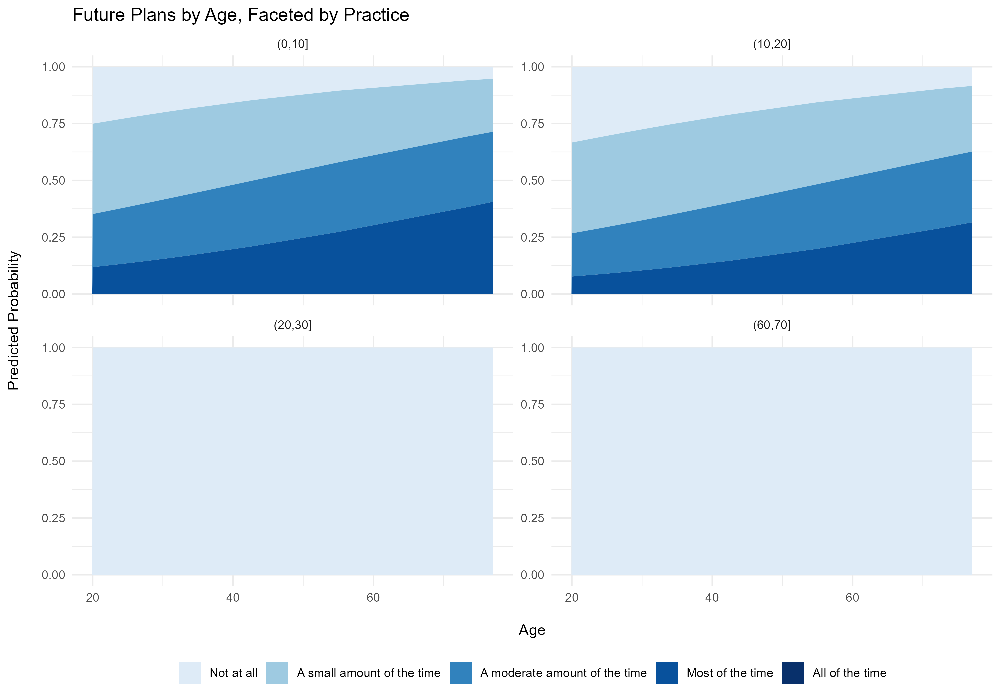


```

We can also examine the nature of the interactions between demographics variables. The vif() outputs below indicate that multicollinearity shouldn't be a problem.

```{r}
demographics <- c('Age', 'Gender', 'Music_listening', 'Practice', 'Floor')
demographics_data <- dplyr::select(data, all_of(demographics))

# Convert categorical variables to numeric
demographics_numeric <- demographics_data %>%
  mutate(
    Gender = as.numeric(factor(Gender)),
    Music_listening = as.numeric(factor(Music_listening, ordered = TRUE)),  
    Floor = as.numeric(factor(Floor))
  ) 

# Compute correlation matrix
cor_matrix <- cor(demographics_numeric, use = "pairwise.complete.obs")

# Plot heatmap
corrplot(cor_matrix, method = "color", type = "lower", 
         tl.col = "black", tl.srt = 45, addCoef.col = "white", 
         col = colorRampPalette(c("blue", "white", "red"))(200))

#Here's another way of visualising the interactions
ggplot(data, aes(x = Age, y = Practice, color = Floor)) +
  geom_point(alpha = 0.6) +  
  geom_smooth(method = "lm", se = FALSE, linetype = "dashed") +
  facet_wrap(~ Floor) +
  labs(title = "Age vs. Practice by Floor",
       x = "Age", 
       y = "Practice (Number of Years)") +
  theme_minimal()

#Checking for collinearity
model1 <- lm(Age ~ Practice + Gender + Music_listening + Floor, data = demographics_numeric)
model2 <- lm(Gender ~ Age + Practice + Music_listening + Floor, data = demographics_numeric)
model3 <- lm(Practice ~ Age + Gender + Music_listening + Floor, data = demographics_numeric)
model4 <- lm(Music_listening ~ Age + Gender + Practice + Floor, data = demographics_numeric)
model5 <- lm(Floor ~ Age + Gender + Practice + Music_listening, data = demographics_numeric)
vif(model1)
vif(model2)
vif(model3)
vif(model4)
vif(model5)


```

#Part 2
##Descriptive 2

We can now do a similar analysis for the data from the second part of the concert.

First we load the dataset.

```{r}
#Loading dataset, sheet 2

library(conflicted)
conflict_prefer("filter", "dplyr")

data_paper2 <- read_csv("input/PUC2.csv")

```

```{r}
recode <- c("1" = "Not at all",
                "2" = "A small amount of the time",
                "3" = "A moderate amount of the time",
                "4" = "Most of the time",
                "5" = "All of the time")

recode2 <- c("1" = "Not at all",
             "2" = "Slightly",
             "3" = "Moderately",
             "4" = "Mostly",
             "5" = "Entirely")

data_paper2[, 2:10] <- lapply(data_paper2[, 2:10], function(x) recode[as.character(x)])
data_paper2[, 13:15] <- lapply(data_paper2[, 13:15], function(x) recode2[as.character(x)])
data_paper2[, 18:20] <- lapply(data_paper2[, 18:20], function(x) recode2[as.character(x)])
```

```{r}
data_qualtrics2 <- read_csv("input_qualtrics/PUC2.csv")
data_qualtrics2 <- data_qualtrics2 %>% dplyr::filter(Finished == "TRUE") %>% 
  dplyr::select(-StartDate, -EndDate, -Status, -Progress, -Duration, 
         -RecordedDate, -DistributionChannel, -UserLanguage, -Finished, -ResponseId)
```


Again, the Qualtrics data also needs reloading and reworking.

```{r}
final_qualtrics2 <- data_qualtrics2 %>%
    filter(!is.na(Movement_mem)) %>% filter(!is.na(Movement_story)) %>%
  mutate(Movement_mem = paste0("Br", str_extract(Movement_mem, "\\d+"))) %>%
    mutate(Movement_story = paste0("Br", str_extract(Movement_story, "\\d+")))


```


Combine the Qualtrics and paper data.
```{r}
data2 <- bind_rows(data_paper2, final_qualtrics2)

```


As in the first half, a dataframe is created showing thought types in a long format with counts for each frequency.

```{r}
thought_types <- c("Fictional_story", "Abstract_shapes", "Sensory_sensations", "Life_experiences", "Media", "Music", "Future_plans", "Building", "Everyday")

thoughts_long2 <- data2 %>%
  pivot_longer(cols = thought_types,
               names_to = "Category", 
               values_to = "Response") %>%
  count(Category, Response) %>% 
  mutate(Response = factor(Response, 
                           levels = c("Not at all", 
                                      "A small amount of the time", 
                                      "A moderate amount of the time", 
                                      "Most of the time", 
                                      "All of the time"))) %>% 
  mutate(Category = factor(Category, 
                           levels = rev(c("Fictional_story", 
                                          "Abstract_shapes", 
                                          "Sensory_sensations", 
                                          "Life_experiences", 
                                          "Media", 
                                          "Music", 
                                          "Future_plans", 
                                          "Building", 
                                          "Everyday")))) %>% 
  filter(!is.na(Response))

```

This dataframe is used to create a plot showing the counts for each type of thought during the first half.
```{r}
ggplot(thoughts_long2, aes(x = Response, y = Category, fill = n)) +
  geom_tile(color = "white") +  # Add white borders to tiles
  scale_fill_gradient(low = "lightblue", high = "darkblue") +  # Adjust color gradient
  labs(title = "Category Response Counts", x = "Response", y = "Category", fill = "Count") +
  theme_minimal() +
  theme(axis.text.x = element_text(angle = 45, hjust = 1))  # Rotate x-axis labels


ggsave("Plots/Descriptive/Overall thought counts, part2.png", width = 7, height = 5, dpi = 300, bg = 'white')

```

We need to pull the demographic information from the first half of the concert and match it to the second half, making sure it's matched to the right participant.
```{r}
demographics <- data[, c("Age", "Gender", "Music_listening", "Practice", "Location", "Participant_number", "ID")] 

data2 <- data2 %>%
  mutate(join_key = ifelse(!is.na(Participant_number), Participant_number, ID))

demographics <- demographics %>%
  mutate(join_key = ifelse(!is.na(Participant_number), Participant_number, ID))

data2 <- data2 %>%
  left_join(demographics, by = "join_key")

data2 <- data2 %>% dplyr::select(-Participant_number.y, -ID.y, -Participant_number.x, -ID.x)

```

Now we look at the the counts for the movements people select as invoking the most vivid memory or story.

```{r}
mems2 <- data2$Movement_mem %>% na.omit() %>% toupper()
stories2 <- data2$Movement_story %>% na.omit() %>% toupper()


# Split values by ";", ",", or whitespace
split_values_mem2 <- unlist(strsplit(mems2, "[; ,]+"))
split_values_story2 <- unlist(strsplit(stories2, "[; ,]+"))

# Trim whitespace
split_values_mem2 <- trimws(split_values_mem2)
split_values_story2 <- trimws(split_values_story2)

# Count occurrences
value_counts_mem2 <- table(split_values_mem2)
value_counts_story2 <- table(split_values_story2)

```


```{r}

# Define the recode map
recode_map2 <- list(
  BR1 = "Brahms, movement 1 — Allegro non troppo", 
  BR2 = "Brahms, movement 2 — Andante, un poco adagio", 
  BR3 = "Brahms, movement 3 — Scherzo: Allegro", 
  BR4 = "Brahms, movement 4 — Finale"
)


split_values_mem2 <- as.character(split_values_mem2)
split_values_story2 <- as.character(split_values_story2)

recoded_mem2 <- dplyr::recode(split_values_mem2, !!!recode_map2)
recoded_story2 <- dplyr::recode(split_values_story2, !!!recode_map2)

# Convert to data frames of counts
df_mem_counts2 <- as.data.frame(table(recoded_mem2))
colnames(df_mem_counts2) <- c("Movement", "count")

df_story_counts2 <- as.data.frame(table(recoded_story2))
colnames(df_story_counts2) <- c("Movement", "count")

# Set movement factor levels for proper ordering
df_mem_counts2$Movement <- factor(df_mem_counts2$Movement, levels = recode_map2)
df_story_counts2$Movement <- factor(df_story_counts2$Movement, levels = recode_map2)

# Plot for 'memories'
mem_plot2 <- ggplot(df_mem_counts2, aes(x = Movement, y = count, fill = Movement)) +
  geom_bar(stat = "identity", position = "dodge") +
  theme_minimal() +
  labs(title = "Movement Counts for Memories", x = "Movement", y = "Count") +
 theme(axis.title.x = element_blank(), 
        axis.text.x = element_blank(),  
        axis.ticks.x = element_blank()) +
  scale_fill_brewer(palette = "Set3") + 
  guides(fill = guide_legend(title = "Movement")) +
  scale_y_continuous(breaks = scales::breaks_pretty(n = 5))  


ggsave("Plots/Descriptive/Movement counts for memories, part 2.png", plot = mem_plot2, width = 7, height = 5, dpi = 300, bg = 'white')

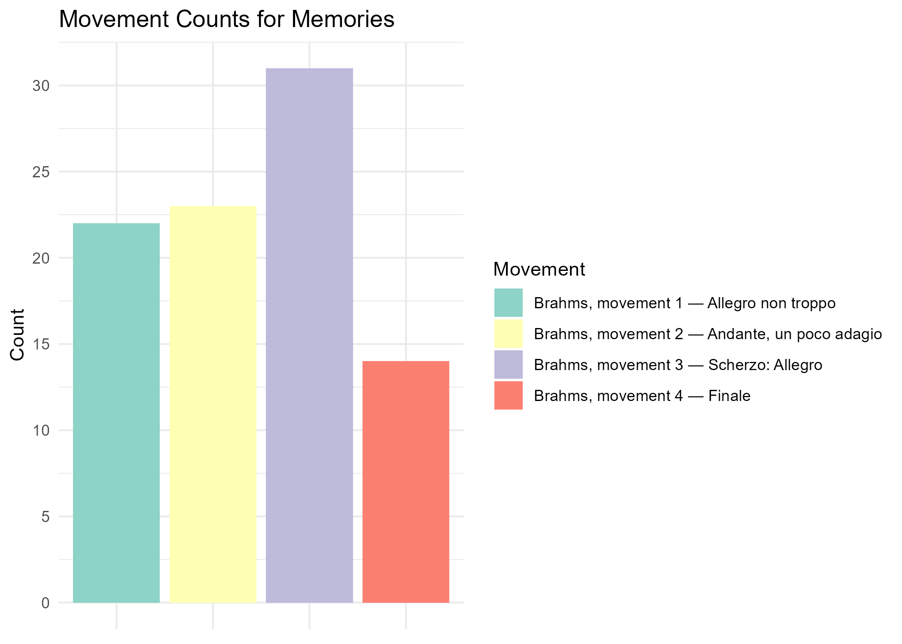

# Plot for 'stories'
story_plot2 <- ggplot(df_story_counts2, aes(x = Movement, y = count, fill = Movement)) +
  geom_bar(stat = "identity", position = "dodge") +
  theme_minimal() +
  labs(title = "Movement Counts for Stories", x = "Movement", y = "Count") +
 theme(axis.title.x = element_blank(),  # Remove x-axis title
        axis.text.x = element_blank(),   # Remove x-axis labels
        axis.ticks.x = element_blank()) +
  scale_fill_brewer(palette = "Set3") + 
  guides(fill = guide_legend(title = "Movement")) +
  scale_y_continuous(breaks = scales::breaks_pretty(n = 5)) 

ggsave("Plots/Descriptive/Movement counts for stories, part 2.png", plot = story_plot2, width = 7, height = 5, dpi = 300, bg = 'white')

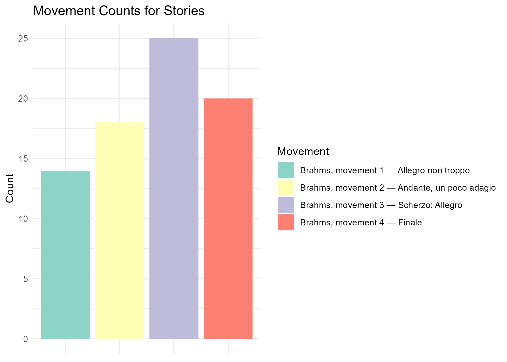
```


To look at relationships with demographic variables, we again tidy the demographic data.
```{r}
#Creating a 'floor' variable, with 2 factors showing downstairs and upstairs locations.
data2 <- data2 %>%
  mutate(Floor = ifelse(Location %in% c("A", "B", "C", "D", "E", "F"), "Downstairs", "Upstairs")) %>% relocate(Floor, .after = Location)

#Removing NA.s
data2 <- data2 %>%
  filter(!is.na(Age) & !is.na(Gender) & !is.na(Music_listening) & !is.na(Floor) & !is.na(Fictional_story) & !is.na(Practice)) %>%
  filter(!is.infinite(Age) & !is.infinite(Gender) & !is.infinite(Music_listening) & 
         !is.infinite(Floor) & !is.infinite(Fictional_story) & !is.infinite(Practice))

#Making sure demographic variables are classed in the right way.
data2$Age <- as.numeric(data2$Age)
data2$Practice <- as.numeric(as.character(data2$Practice))
data2$Gender <- factor(data2$Gender,  levels = c('Male', 'Female', 'Other'))
data2$Music_listening <- factor(data2$Music_listening, levels = c('Very rarely', 'Somewhat rarely', 'Moderately frequently', 'Frequently', 'Very frequently'))
data2$Floor <- factor(data2$Floor, levels = c('Downstairs', 'Upstairs'))
data2$Fictional_story <- factor(data2$Fictional_story, 
                               levels = c("Not at all", "A small amount of the time", 
                                          "A moderate amount of the time", 
                                          "Most of the time", "All of the time"))
```

Here are 3 sets of descriptive plots to match those used in part 1, for age, gender and floor.

1) Descriptive plot for Age and types of thought -- age is converted into a grouped variable:
```{r}
# Create Age bins
data2 <- data2 %>%
  mutate(Age_group = cut(Age, 
                         breaks = seq(floor(min(Age, na.rm = TRUE)), 
                                      ceiling(max(Age, na.rm = TRUE)) + 20, by = 5), 
                         include.lowest = TRUE, 
                         right = FALSE))  # Ensures the last group includes the highest value

# List of outcome variables
outcome_vars <- c("Fictional_story", "Abstract_shapes", "Sensory_sensations", 
                  "Life_experiences", "Media", "Music", "Future_plans", 
                  "Building", "Everyday")

# Convert all outcome variables to factors with consistent levels
data2[outcome_vars] <- lapply(data2[outcome_vars], factor, 
                             levels = c("Not at all", "A small amount of the time", 
                                        "A moderate amount of the time", "Most of the time", 
                                        "All of the time"))

# Create a single summary_data dataframe
summary_data2 <- data2 %>%
  pivot_longer(cols = all_of(outcome_vars), names_to = "Outcome", values_to = "Response") %>%
  group_by(Age_group, Outcome, Response) %>%
  summarise(count = n(), .groups = "drop") %>%
  group_by(Age_group, Outcome) %>%
  mutate(prop = count / sum(count)) %>%
  ungroup()

# Looping through each outcome variable to generate plots
plot_list <- list()
for (outcome in outcome_vars) {
  plot_data2 <- summary_data2 %>% filter(Outcome == outcome)
  plot <- ggplot(plot_data2, aes(x = Age_group, y = prop, fill = Response)) +
    geom_bar(stat = "identity", position = "stack", alpha = 0.8) + 
    labs(x = "\nAge Group", y = "Proportion\n", title = paste(outcome)) +
    scale_fill_manual(
      name = "Response Level",
      values = setNames(c("#deebf7", "#9ecae1", "#3182bd", "#08519c", "#08306b"), 
                      levels(data[[outcome]]))
    ) +
    theme_minimal() + theme(axis.text.x = element_text(angle = 45, hjust = 1))
  
  plot_list[[outcome]] <- plot
}

library(grid)

# Arranging plots in a grid and saving

title_grob <- textGrob("Types of Thoughts by Age, Second Half", gp = gpar(fontsize = 16, fontface = "bold"))

Age_thoughts_grid2 <- grid.arrange(
  grobs = plot_list, 
  ncol = 3, 
  top = title_grob  
)

ggsave("Plots/Descriptive/Age and thoughts, part 2.png", plot = Age_thoughts_grid2, width = 20, height = 12, dpi = 300, bg = 'white')

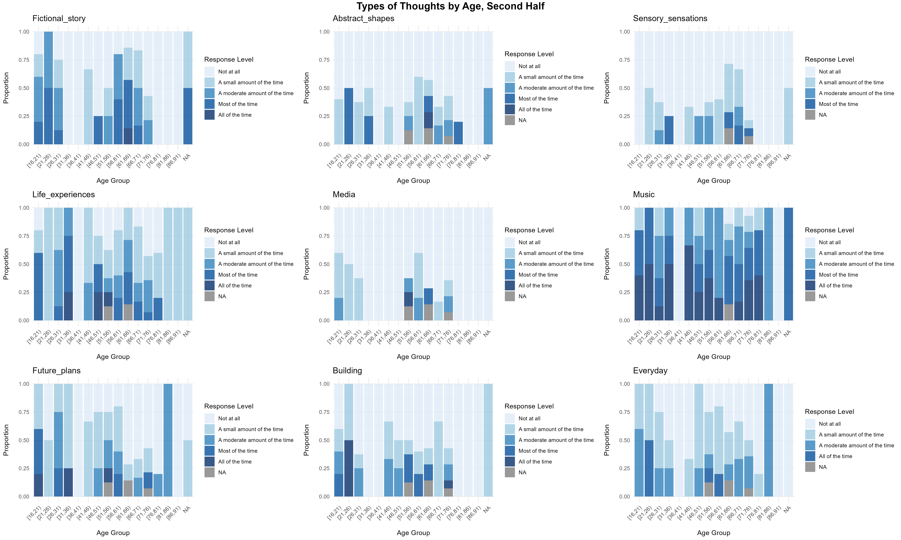

```


2) Descriptive plot for gender and types of thought.

```{r}
# Remove missing values + filter
data2 <- data2 %>%
  filter(!is.na(Gender)) %>% filter(Gender != 'Other')

# Create a single summary_data dataframe
summary_data2 <- data2 %>%
  pivot_longer(cols = all_of(outcome_vars), names_to = "Outcome", values_to = "Response") %>%
  group_by(Gender, Outcome, Response) %>%
  summarise(count = n(), .groups = "drop") %>%
  group_by(Gender, Outcome) %>%
  mutate(prop = count / sum(count)) %>%
  ungroup()

# Looping through each outcome variable to generate plots
plot_list <- list()
for (outcome in outcome_vars) {
  plot_data2 <- summary_data2 %>% filter(Outcome == outcome)
  plot2 <- ggplot(plot_data2, aes(x = Gender, y = prop, fill = Response)) +
    geom_bar(stat = "identity", position = "stack", alpha = 0.8) + 
    labs(x = "\nGender", y = "Proportion\n", title = paste(outcome)) +
    scale_fill_manual(
      name = "Response Level",
      values = setNames(c("#deebf7", "#9ecae1", "#3182bd", "#08519c", "#08306b"), 
                      levels(data[[outcome]]))
    ) +
    theme_minimal()
  
  plot_list[[outcome]] <- plot2
}

title_grob <- textGrob("Types of Thoughts by Gender, Second Half", gp = gpar(fontsize = 16, fontface = "bold"))

Gender_thoughts_grid2 <- grid.arrange(
  grobs = plot_list, 
  ncol = 3, 
  top = title_grob  
)

ggsave("Plots/Descriptive/Gender and thoughts, part 2.png", plot = Gender_thoughts_grid2, width = 20, height = 12, dpi = 300, bg = 'white')
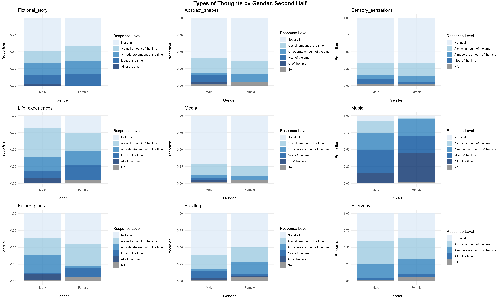

```
3) Descriptive plot for floor

```{r}
# Remove missing values
data2 <- data2 %>%
  filter(!is.na(Floor))

# Create a single summary_data dataframe
summary_data2 <- data2 %>%
  pivot_longer(cols = all_of(outcome_vars), names_to = "Outcome", values_to = "Response") %>%
  group_by(Floor, Outcome, Response) %>%
  summarise(count = n(), .groups = "drop") %>%
  group_by(Floor, Outcome) %>%
  mutate(prop = count / sum(count)) %>%
  ungroup()

# Looping through each outcome variable to generate plots
plot_list <- list()
for (outcome in outcome_vars) {
  plot_data2 <- summary_data2 %>% filter(Outcome == outcome)
  plot3 <- ggplot(plot_data2, aes(x = Floor, y = prop, fill = Response)) +
    geom_bar(stat = "identity", position = "stack", alpha = 0.8) + 
    labs(x = "\nFloor", y = "Proportion\n", title = paste(outcome)) +
    scale_fill_manual(
      name = "Response Level",
      values = setNames(c("#deebf7", "#9ecae1", "#3182bd", "#08519c", "#08306b"), 
                      levels(data[[outcome]]))
    ) +
    theme_minimal()

  plot_list[[outcome]] <- plot3
}

title_grob <- textGrob("Types of Thoughts by Floor, Second Half", gp = gpar(fontsize = 16, fontface = "bold"))

Floor_thoughts_grid2 <- grid.arrange(
  grobs = plot_list, 
  ncol = 3, 
  top = title_grob  
)

ggsave("Plots/Descriptive/Floor and thoughts, part 2.png", plot = Floor_thoughts_grid2, width = 20, height = 12, dpi = 300, bg = 'white')

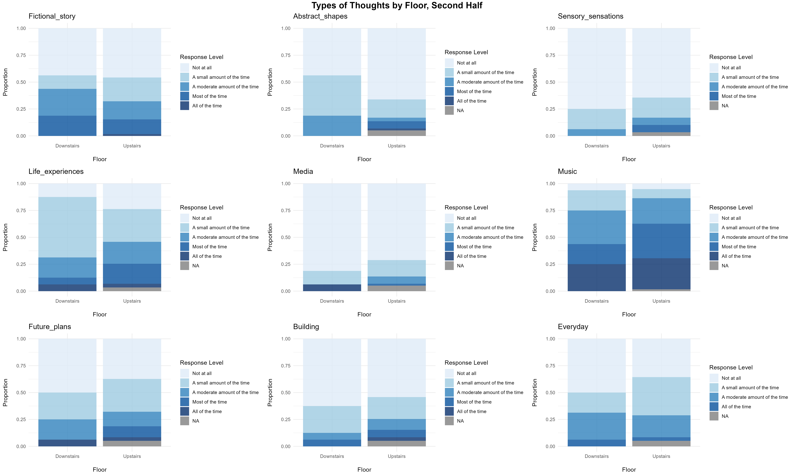

```

##Modelling 2

Now we can construct some some ordinal regression models describing the relationship between demographic data and thought types.

Again we can filter through the demographic variables for each thought type, and see which ones have effects on thought types.

```{r}
# List to store results
models <- list()
stepwise_models <- list()

# Loop through selected outcomes
for (outcome in outcome_vars) {
  
  # Define formula
  formula <- as.formula(paste(outcome, "~ Age + Gender + Music_listening + Practice + Floor"))
  
  tryCatch({
    # Subset data and drop NAs relevant to formula
    modeling_data <- na.omit(data2[, all.vars(formula)])
    
    # Ensure outcome is ordered (if it makes sense — you might want to tweak this per outcome)
    modeling_data[[outcome]] <- factor(modeling_data[[outcome]], ordered = TRUE)
    
    # Skip if outcome has too few observations in any level
    level_counts <- table(modeling_data[[outcome]])
    if (any(level_counts < 3)) {
      cat("\nSkipping", outcome, "due to rare levels in outcome:\n")
      print(level_counts)
      next
    }
    
    # Skip if any predictor has zero variance
    predictors <- modeling_data[, setdiff(all.vars(formula), outcome)]
    if (any(sapply(predictors, function(x) var(as.numeric(x), na.rm = TRUE) == 0))) {
      cat("\nSkipping", outcome, "due to zero-variance predictor.\n")
      next
    }

    # Fit proportional odds model
    model <- polr(formula, data = modeling_data, Hess = TRUE, method = "probit")
    models[[outcome]] <- model
    
    # Print model summary
    cat("\nSummary for", outcome, ":\n")
    print(summary(model))
    
    # Run backward stepwise selection
    step_model <- step(model, direction = "backward", trace = FALSE)
    stepwise_models[[outcome]] <- step_model
    
    # Print stepwise summary
    cat("\nStepwise Model Summary for", outcome, ":\n")
    print(summary(step_model))
    
  }, error = function(e) {
    cat("\nSkipping", outcome, "due to error:", e$message, "\n")
  })
}
```

Emmeans plots are shown here for the relationship between Age and each thought type.

```{r}
# Only some of the outcome variables can be successfully plotted

outcome_vars <- c("Fictional_story", "Abstract_shapes",
                  "Life_experiences", "Music", "Future_plans", 
                   "Everyday")

plot_list <- list()
for (outcome in outcome_vars) {
model <- polr(as.formula(paste(outcome, "~ Age")), data = data2, Hess = TRUE)

predicted_probs <- ggemmeans(model, terms = c("Age"))
  
plot <- ggplot(predicted_probs, aes(x = x, y = predicted, fill = response.level)) +
    geom_area() + 
    labs(x = "\nAge", y = "Predicted Probability\n", 
         title = paste(outcome, "by Age")) +
    scale_fill_manual(
      name = NULL,
      values = setNames(c("#deebf7", "#9ecae1", "#3182bd", "#08519c", "#08306b"), 
                      levels(data[[outcome]])),
      labels = c("Not at all", "A small amount of the time", "A moderate amount of the time", 
                 "Most of the time", "All of the time"),
      breaks = c("Not at all", "A small amount of the time", "A moderate amount of the time", 
                 "Most of the time", "All of the time")
    ) + 
    theme_minimal()
  

  plot_list[[outcome]] <- plot
}

title_grob <- textGrob("Types of Thoughts by Age, Second Half", gp = gpar(fontsize = 16, fontface = "bold"))

Age_thoughts_models <- grid.arrange(
  grobs = plot_list, 
  ncol = 3, 
  top = title_grob  
)

ggsave("Plots/Models/Thoughts and age, part 2.png", plot = Age_thoughts_models, width = 17, height = 7, dpi = 300, bg = 'white')

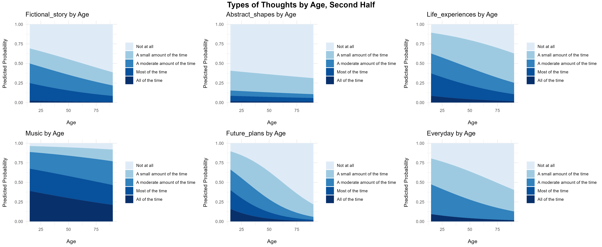

```


After narrowing down models using the step() method above, the main predictors are Practice and Music_listening for Fictional_story, Music_listening and Floor for Abstract Shapes, and Practice for Everyday. These can be plotted below.
